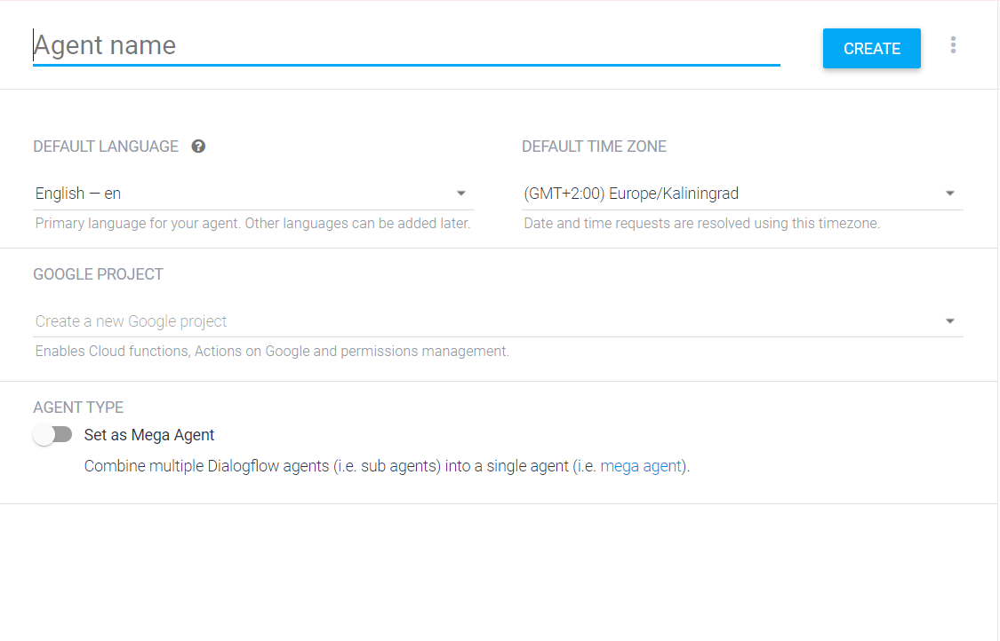
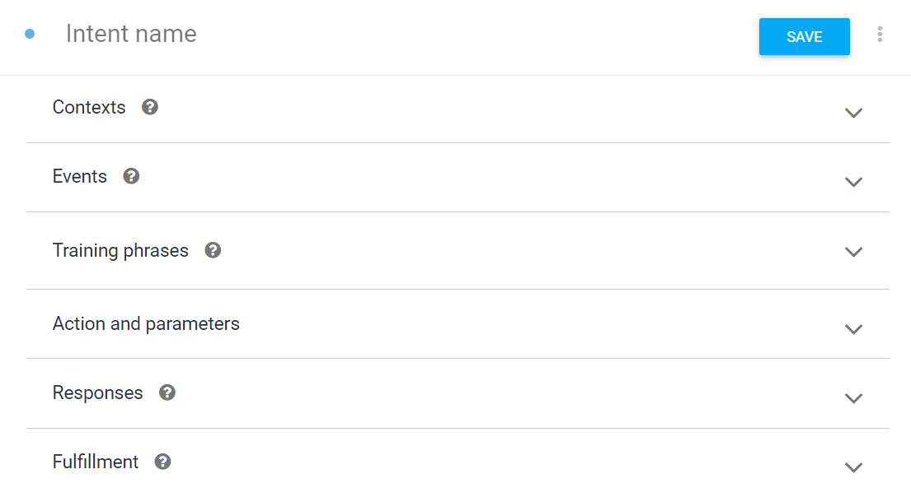
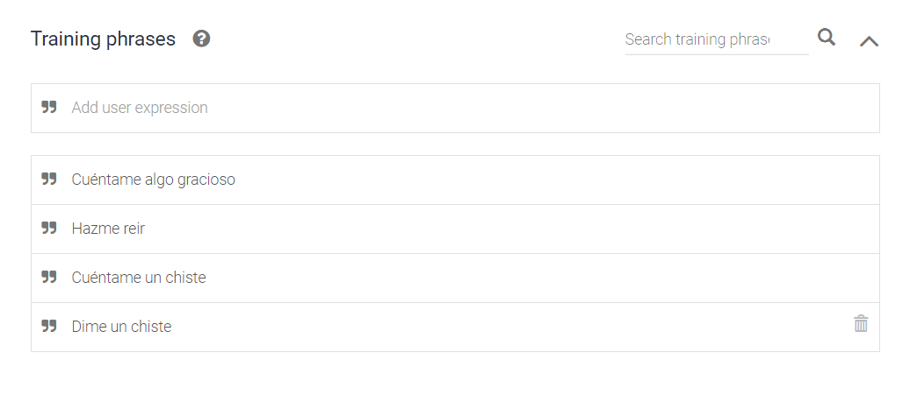
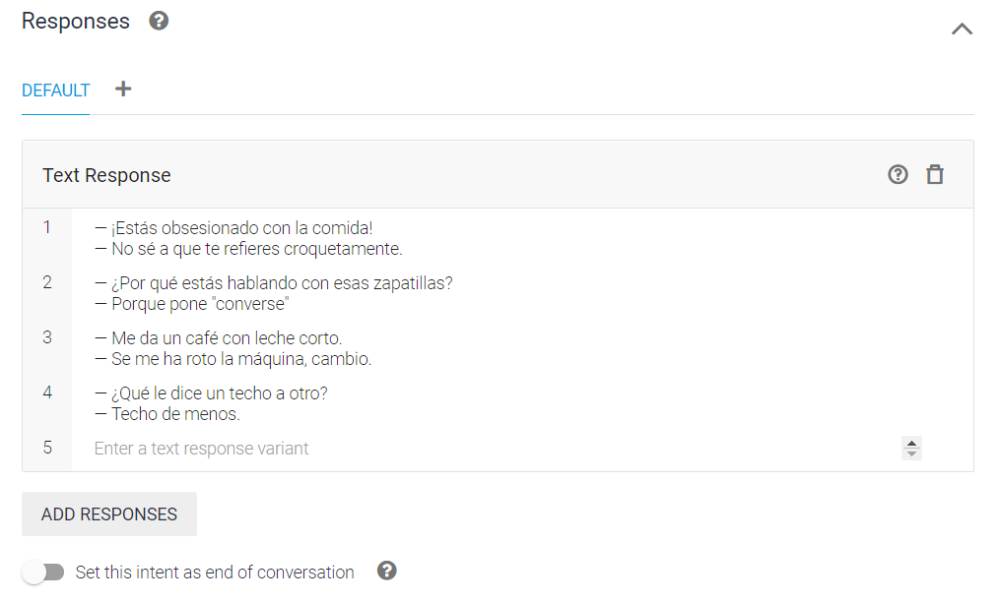
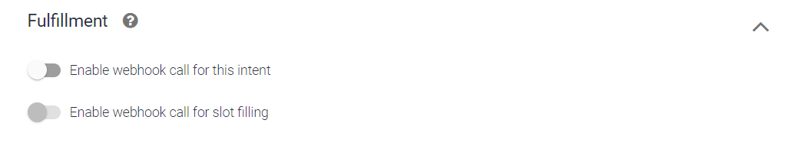

# Crear un chatbot a partir de DialogFlow

Los pasos a seguir para crear un chatbot són los siguientes:
- Crear el diagrama de flujo del chatbot
- Crear un agente
- Crear un/varios intent/s
- Definir un/varios entity/ies
- (Opcional) Añadir un backend
- Integrar el chatbot

## 1. Crear un agente

Para crear un agente simplemente se le ha indicar:

- El nombre
- El idioma que queremos que utilize
- La franja horaria
- (Opcional) Enlazarlo con un proyecto de Google Cloud

Una vez creados, veremos que existen dos intents por defecto:
- **Default Fallback Intent**: Salta cuando el chatbot no ha interpretado ningún intent.
- **Default Welcome Intent**: Responde con un saludo.

Ambos no se pueden eliminar ya que se consideran esenciales para el flujo del chatbot.

## 2. Crear un intent

Al crear un nuevo intent, a parte de definir un nombre, nos encontramos con los siguientes apartados:

### Training Phrases

Las frases de entrenamiento son las frases con las que el chatbot se entrenará para indexar esas frases con el `intent` definido. De esta manera cuando el usuario escriba una frase similar identificará el intent concreto. 

Ejemplo de _training phrases:_

### Respuestas

### Contexto

### Parametros

### Fulfillment

## 3. Crear un entity

## 4. Implementar lógica del chatbot a partir del fulfillment

## 5. Entrenar el chatbot y testearlo

## 6. Integrarlo