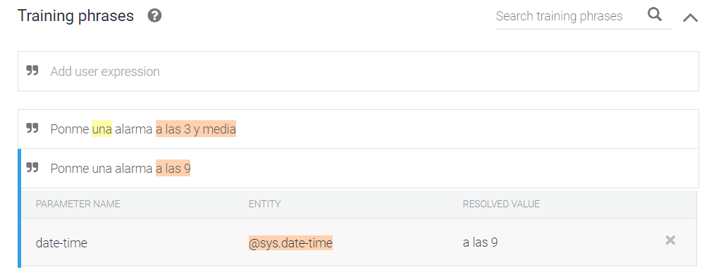
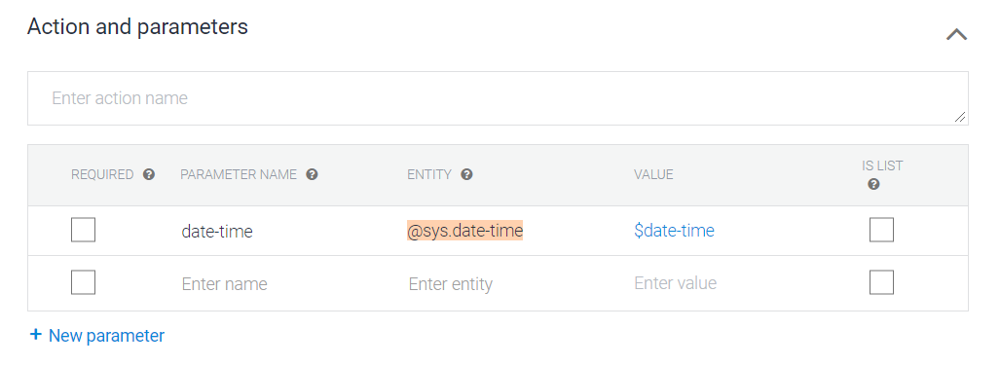
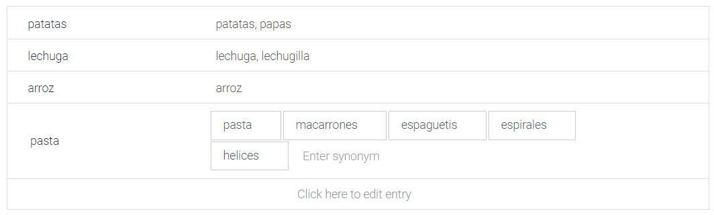

# Crear un chatbot a partir de DialogFlow

Los pasos a seguir para crear un chatbot són los siguientes:
- Crear el diagrama de flujo del chatbot
- Crear un agente
- Crear un/varios intent/s
- Definir un/varios entity/ies
- (Opcional) Añadir un backend
- Integrar el chatbot

## 1. Crear un agente

Para crear un agente simplemente se le ha indicar:

- El nombre
- El idioma que queremos que utilize
- La franja horaria
- (Opcional) Enlazarlo con un proyecto de Google Cloud


Una vez creados, veremos que existen dos intents por defecto:
- **Default Fallback Intent**: Salta cuando el chatbot no ha interpretado ningún intent.
- **Default Welcome Intent**: Responde con un saludo.

Ambos no se pueden eliminar ya que se consideran esenciales para el flujo del chatbot.

## 2. Crear un intent

Al crear un nuevo intent, a parte de definir un nombre, nos encontramos con los siguientes apartados:


### Training Phrases

Las frases de entrenamiento son las frases con las que el chatbot se entrenará para indexar esas frases con el `intent` definido. De esta manera cuando el usuario escriba una frase similar identificará el intent concreto. 

Ejemplo de _training phrases:_


### Respuestas


En la creación de cada `intent` también hemos de indicar la respuesta que dará nuestro chatbot. Esta respuesta se realiza por dos razones:
1. Mostrar que el chatbot esta respondiendo a un input concreto del usuario.
2. Responder o dar la información que el usuario pide.

`!importante:`Existen muchas maneras poder dar formato a nuestras respuestas según el lugar donde se acabe integrando el chatbot. Todo y así en este workshop solo se aprofundirá en las respuestas de texto aleatorias. Pero si sientes curiosidad en formatear estas respuestas te recomiendo leer el siguiente [enlace](https://cloud.google.com/dialogflow/docs/intents-rich-messages)


En la sección de respuestas de `DialogFlow` puedes poner tantas entradas como desees. Si existe más de una DialogFlow escogerá una al azar para responder. Si observamos el siguiente ejemplo, existen varias respuestas para el mismo ejemplo.


Existe la posibilidad que si tu chatbot necesita responder con más de una frase. (p. e. el primero al azar, el segundo fijo), entonces puedes añadir más respuestas dandolé al botón `ADD RESPONSES` -> seguido de -> `Text response`.

### Fulfillment

En el caso de que nuestro chatbot requiera de una lógica más compleja a la hora de responder o necesite una información de terceros, entonces podemos activar la opción de `fulfillment` (que se aprofundizará más a continuación), de manera que el intent no sacará una respuesta de está interfaz sino que llamará al backend que hemos implementado para recoger la respuesta de allí.


### Parametros

Existen diferentes casos en que detectar el `intent` de la frase no es suficiente y necesitamos hacer uso de los `parametros`. 

Un ejemplo común para entender el concepto de parametro sería:

```
Ponme una alarma a las 9.
```

El chatbot reconocería que la intención del usuario que seria la misma que si dijera:

```
Ponme una alarma a las tres y media.
```

En ambos casos el usuario quiere poner una alarma, la diferencia es la hora de la alarma. De esta manera necesitamos definir un parametro para tratar esta información.

Es posible que Dialogflow ya detecte por defecto los parametros que vamos a necesitar, todo y así es posible que tengan que ser modificados. Con este ejemplo solo queremos extraer la hora, todo y así Dialogflow nos ha detectado la hora y la palabra `una` como parametro a extraer. 




Como no nos interesa extraer esta información simplmenete eliminaremos de forma manual el tag de color amarillo.

De esta manera nos queda un único parametro que contiene la siguiente información:



Se pueden añadir parametros manualmente pero al detectar Dialogflow este parametro se han puesto los anteriores valores por defecto. 

- **Required**: Indica si es necesario que el intent haya de tener ese parametro. En el caso de que sea un parametro necesario podemos añadir un 'prompt' para que el usuario dé esa información necesaria.
- **Parameter name**: Es el nombre del parametro con el que luego se accedera al contenido.
- **Entity**: El tipo de entidad que existen por defecto algunas entidades del sistema que se pueden elegir desde allí o si es necesario podemos crear uno personalizado (y que se explcará en los siguientes apartados).
- **Value**: Es el nombre del índice que se indexa en las frases de entrenamiento. (La o las palabras que estan subrayadas de un color).
- **Is list** Activar si esperamos una lista de valores. Por ejemplo: `Ponme una alarma a las 10 y a las 12`. El parametro será un array con dos elementos: `[ "2020-04-04T10:00:00+02:00", "2020-04-04T11:00:00+02:00" ]`

En resumen: **Definiremos un parametro para cada información variable que queremos guardar o tratar.**

### Contexto

Estos parametros de entrada y salida permiten controlar el flujo de una conversación. En este workshop no se aprofundirá sobre el tema pero podeis informaros en el siguiente [enlace](https://cloud.google.com/dialogflow/docs/contexts-input-output?hl=es-419)

A nivel general hay que saber que los contextos permiten detectar mejor un intent cuando varios intents diferentes tienen frases de entrenamiento iguales o cuando requiere una información previa para continuar.

Un ejemplo:


Los contextos que veremos serán los relacionados con los `prompts` a la hora de utilizar parametros que sean necesarios.

### Eventos

`Normalmente, se detecta una coincidencia con un intent cuando una expresión de usuario final se corresponde con una frase de entrenamiento de intent. Sin embargo, también puedes activar intents mediante eventos.`[3](https://cloud.google.com/dialogflow/docs/events-overview?hl=es-419)

En estos casos los eventos dependerán de donde está integrado el chatbot. Existe una lista de eventos que están implementados y que podemos elegir. Todo y así, podemos crear eventos personalizados mediante su API [enlace](https://cloud.google.com/dialogflow/docs/events-custom?hl=es-419).

## 3. Crear un entity

Tal y como hemos visto en el apartado de `Actions y parameters` durante la creación de un intento, todo parametro se le ha de asignar una entidad. Existen muchas entidades predeterminadas por Dialogflow como puede ser: `country`, `city`, `date`, `email`, `url` ....

Todo y así es posible que necesitemos crear una entidas personalizada para casos concretos, esta entidad se puede simplicifar a un diccionario finito de entradas donde cada entrada puede contener sinónimos.

Por ejemplo, si nuestro chatbot genera recetas a partir de los ingredientes que el usuario indica, necesitaremos esos ingredientes como parametros. Y aquí surgen dos hechos:
- Necesito una entidad que cubra solo los ingretientes que el backend puede llegar a tratar.
- Necesito relacionar diferentes palabras con un mismo concepto a partir de sinónimos. Por ejemplo, una receta con `papas` será de la misma forma que si digo `patatas`. 




## 4. Implementar lógica del chatbot a partir del fulfillment

El backend de Dialogflow puede ser hosteado en un servidor propis utilizando la API de Dialogflow, de manera que puede ser implementado por el lenguaje preferido y tiene menos limitaciones.

Otra opción que nos facilita Dialogflow para hacer cosas más sencillas sin necesitar un servidor propio es utilizando el `Inline editor`. Este editor nos encapsula un pequeño código que puede interaccionar con la información que recibe y manda Dialogflow, esta implementado en `Node.js` y tiene la siguiente estructura:

```
const functions = require('firebase-functions');
const { dialogflow } = require('actions-on-google');

// INTENTS
const WELCOME_INTENT = 'Default Welcome Intent';
const FALLBACK_INTENT = 'Default Fallback Intent';


const app = dialogflow();

app.intent(WELCOME_INTENT, (conv) => {
  conv.ask('Welcome to Joke Chatbot! Ask for a joke. I will try to make you laught');
});


app.intent(FALLBACK_INTENT, (conv) => {
  conv.ask('Sorry I didin\'t understand you. Try to say: tell me a joke');
});


exports.dialogflowFirebaseFulfillment = functions.https.onRequest(app);
```

## 5. Entrenar el chatbot y testearlo

## 6. Integrarlo